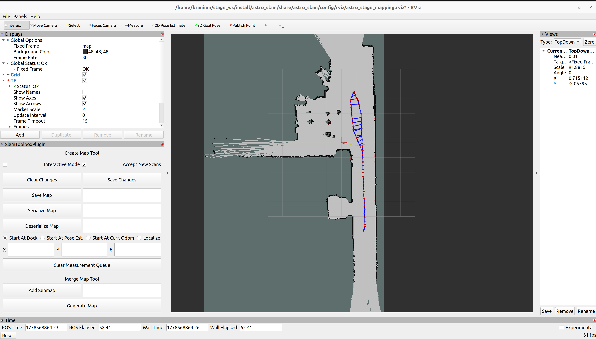
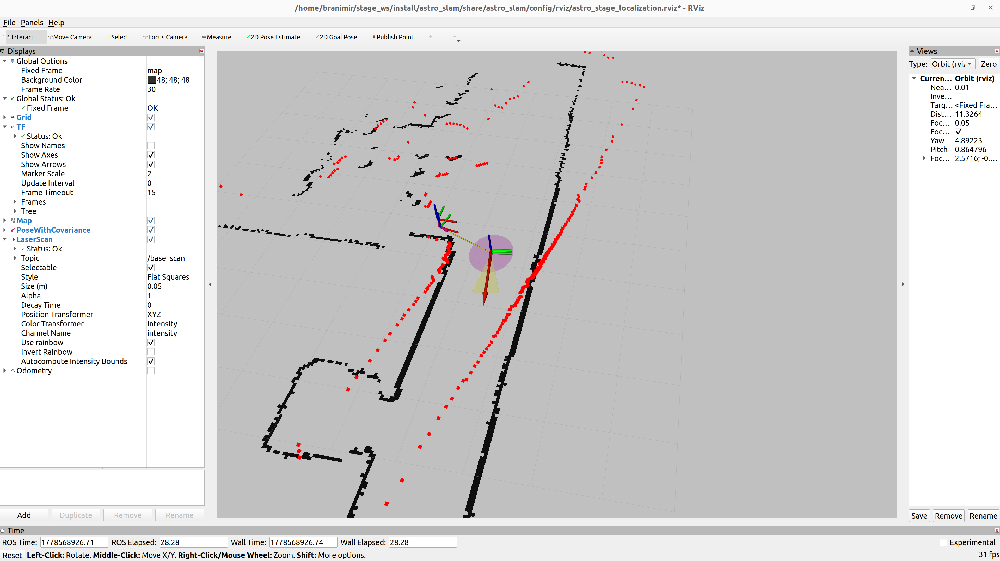
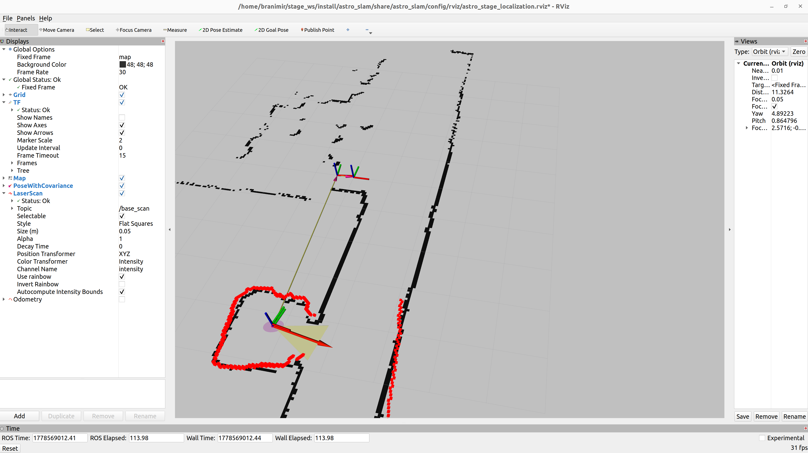

# ASTRO Robot

## Clone and build

Clone the ASTRO packages into your workspace:

```bash
cd ~/stage_ws/src
git clone https://github.com/CRTA-Lab/ASTRO.git
```

Install dependencies and build:

```bash
cd ~/stage_ws
rosdep install --from-paths src/ASTRO --ignore-src -r -y
colcon build --symlink-install
source install/setup.bash
```

> **Note:** If you see the following warning during the build, you can safely ignore it:
> ```
> CMake Warning:
>   Manually-specified variables were not used by the project:
>
>     CATKIN_INSTALL_INTO_PREFIX_ROOT
>     CATKIN_SYMLINK_INSTALL
> ```

---

## Create a map

### 1. Launch the simulation

Start Stage with the ASTRO world and the robot state publisher:

```bash
ros2 launch stage_ros2 demo.launch.py world:=crta_mapa rviz:=false
ros2 launch astro rsp.launch.py
```

### 2. Launch slam_toolbox for mapping

```bash
ros2 launch astro_slam astro_stage_mapping.launch.py
```

This starts `slam_toolbox` in mapping mode alongside RViz with the mapping configuration.

<div align="center">

</div>

### 3. Drive the robot

Use keyboard teleop to drive the robot around the environment:

```bash
ros2 run teleop_twist_keyboard teleop_twist_keyboard
```

Drive the robot until the full environment is mapped in RViz.

### 4. Save the map

Once satisfied with the map, you can save it in two ways:

**Option A — RViz GUI:**
In the slam_toolbox panel on the left side of RViz, type the desired map name into the field next to **Save Map** and click the button. The map files will be saved to the current working directory.

**Option B — Terminal:**
```bash
ros2 run nav2_map_server map_saver_cli -f ~/stage_ws/src/ASTRO/astro_slam/maps/<map_name>
```

---

## Localization on a saved map

Once a map has been saved, launch localization using AMCL:

```bash
ros2 launch stage_ros2 demo.launch.py world:=crta_mapa rviz:=false
ros2 launch astro rsp.launch.py
ros2 launch astro_slam astro_stage_localization.launch.py
```

To use a different map:

```bash
ros2 launch astro_slam astro_stage_localization.launch.py map:=/path/to/your_map.yaml
```

Use the **2D Pose Estimate** tool in RViz to set the robot's initial position on the map.

<div align="center">

</div>

Once the initial pose is set, drive the robot briefly and AMCL particles will converge to the correct position.

<div align="center">

</div>

---

## Navigation

Once localization is running, launch the nav2 navigation stack:

```bash
ros2 launch stage_ros2 demo.launch.py world:=crta_mapa rviz:=false
ros2 launch astro rsp.launch.py
ros2 launch astro_slam astro_stage_localization.launch.py
ros2 launch astro_slam astro_stage_navigation.launch.py
```

Use the **2D Goal Pose** tool in RViz to set a navigation goal for the robot.
